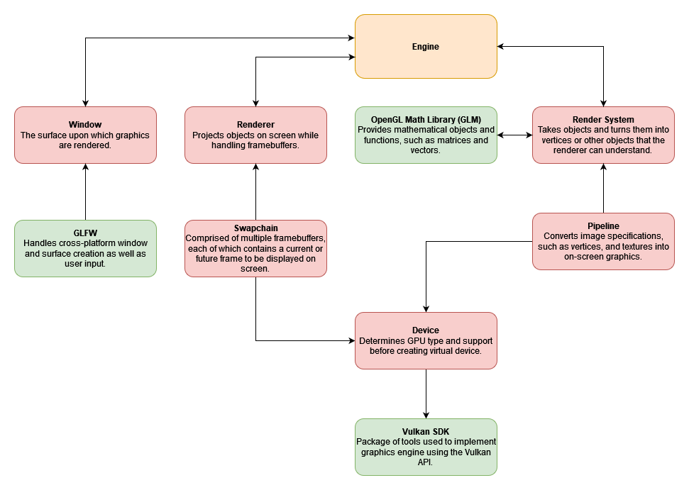

# Hop Engine
#### Bunny Game Co.
#### Contact: jake.mitton@gmail.com
---

### Table Of Contents
### [Notice](#notice-1)
### [Design Overview](#design-overview-1)  
- [Context Diagram](#context-diagram)
### [Logical Design](#logical-design-1)   
- [API](#api)  
- [Audio](#audio)  
- [Input](#input)  
- [Window/Context Generation](#windowcontext-generation)  
- [Image Processing](#image-processing)  
- [Graphics Engine](#graphics-engine)  
	- [Graphics Engine Diagram](#graphics-engine-diagram)
### [Physical Design](#physical-design-1)  
- [File Directory](#file-directory)  
- [Device](#device)  
- [Engine](#engine)  
- [Objects](#objects)  
- [Pipeline](#pipeline)  
- [Render Systems](#render-systems)  
- [Renderer](#renderer)  
- [Swapchain](#swapchain)  
- [Utilities](#utilities)  
- [Window](#window) 
- [Hop.hpp](#hophpp)

---

### Notice

This document will focus on the `engine` subdirectory and it's components. The [file directory](#file-directory) is provided in it's entirety under Physical Design , however the aspects outside of `engine` will not be addressed here.

---

### Design Overview

The design of Hop Engine consists of numerous components which collectively allow user-programmers to accept inputs from the player and display desired game behaviour to the player. In this fashion, the user-programmer can play sound and display various shapes and image assets on the player's screen in accordance with the design of their game.

Below is a context diagram, also called a top-level data flow diagram (DFD).  This context diagram describes how elements within our system interact with one-another and which data is shared between system components. As the most complex subsystem, a data-flow diagram (DFD) for the graphics engine is provided in the logical design section.

For details on the Hop Engine's technical specifications it is recommended to move directly to the [physical design](#physical-design-1).

---

###### Context Diagram



*Figure 1: Context Diagram*

---

As a software library, our project's logical design maps to its physical design in a relatively direct manner. Hop Engine will be written in C++ and will primarily follow object-oriented programming (OOP) design principles. As a result, each element of our logical design corresponds to a class defined in a pair of .hpp and .cpp files, both located in a folder of the same name. For example, the Window component of our logical design corresponds to window.cpp and window.hpp, both located within /engine/src/Window relative to the HopEngine root directory. 

By implementing our design in this segmented manner, we hope to maximize the modularity of our code and enable team members to work on portions of the engine independently from one-another. Team members working on one system component would not need to know precisely how another component was implemented, they would only need to understand the publicly available classes, methods, and member variables of the class or classes corresponding to that component. 

### Logical Design

From a logical design standpoint, Hop Engine can be deconstructed into a number of distinct components. These components are displayed in *Figure 1: Context Diagram* in the previous *Design Overview* section, although a more detailed DFD for the graphics engine is displayed in this section. 

Here we will describe each component in greater detail, including the component's function or purpose and key interactions between the component and other components in the system.

#### API  

- **Purpose:** The API is the sole necessary interface between the user and Hop Engine. While Hop Engine is an open-source project, and all project code is available to users, the API allows Hop Engine to be used without knowledge or understanding of the entire codebase. Users only need to know how to correctly implement the functions and classes declared in the API, and not the definitions of those functions and classes, which exist in a separate file. 

- **Interfaces and Services** The API provides all necessary features to the user. With respect to other components of Hop Engine, the API acts as a central hub and translation unit while providing little functionality itself. The API consolidates several internal class objects into a single user-accessible object and translates user-accessible data into internal representations. For example, data could be accepted as user-readable text strings and then converted into more complex or efficient data types internally. Other components of the engine will use internal data representations, functions, and classes rather than those available to the user.

#### Audio

- **Purpose:** The audio component of Hop Engine has two main responsibilities. Firstly, it creates and validates a context for Hop Engine to play sound. Secondly, it allows users to import audio assets and play them as desired. 

- **Interfaces and Services:** The audio component interfaces with the API by implementing functionality defined in the API related to audio playback. This audio playback functionality is enabled through the use of an external library.

#### Input 

- **Purpose:** The input component of Hop Engine is responsible for accepting mouse and keyboard input from the player and providing it to the user-programmer.

- **Interfaces and Services:** Mouse and keyboard input is first accepted from the player. It is then made available to the user-programmer via the Hop Engine API. The following key information is retrieved from the player and provided to the user-programmer for use in game logic.

    - **Keyboard:** Which keys have been activated and in what manner? Any key can be pressed, released, or held down continuously. These key states are provided to the user so they can implement desired behaviour based on the state of a single key or combination of keys. 

    - **Mouse:** Where is the mouse cursor within the game window? Have any mouse buttons been clicked? This information is provided to the user so they can implement game logic if the mouse is hovering at a particular place or if any mouse button is clicked. These two pieces of information can be combined to determine if a space on the screen has been clicked on, enabling button-like functionality.

#### Window & Context Generation 

- **Purpose:** The window and context generation component of Hop Engine is responsible for ensuring the player's computer supports necessary features of the engine. Firstly, it determines if the player's system has allowed for the game window to be opened. After that it checks whether the player's system allows for the rendering of graphics and playback of audio. If the player's computer lacks the required physical hardware or drivers to use components of Hop Engine, this information is provided to the user-programmer and the game may be terminated. 

- **Interfaces and Services:** The window & context generation subsystem interfaces with the API to tell it what services are available on the user's system. These services include audio playback, graphics rendering, and the creation of the game window itself.

#### Image Processing  

- **Purpose:** The image processing component loads external image assets and makes them available to be displayed on the screen. Individual image files or sprite sheets are loaded from a pre-defined directory and can then be rendered on screen by the graphics engine. 

- **Interfaces and Services:** The image processing component of Hop Engine interfaces with the user via the API to determine which file should be loaded and how large it is. It then makes the file and related information available to the graphics engine, so a texture can be rendered on screen via the game window. 

#### Graphics Engine 

- **Purpose:** The graphics engine renders two-dimensional graphics in the game window based on user parameters and supplied image assets. The rendering of graphics through the graphics engine is a multi-stage process using multiple sub-components, which are described below.  

- **Interfaces and Services:** The graphics engine interfaces with the window & context generation component of Hop Engine to first validate that a valid game window can be generated. It then interfaces with the API to accept user instructions about where and how graphics should be rendered. If image assets are to be displayed as textures on the screen, they are provided by the image processing component via the API.

---

Note 
  
A diagram which describes the components of the graphics engine and their relationship to one-another is shown in figure 2 below.

---

###### Graphics Engine Diagram


*Figure 2: Graphics Engine Diagram*

---

### Physical Design

#### File Directory

The file directory of the Hop Engine is shown below in it's entirety. The files Makefile, README.md, and build.py are beyond the scope of this document. The remaining section under physical design section will focus on the subdirectories within the path `./engine/src/`

```bash
.
├── Makefile
├── README.md
├── build.py
├── engine
│   ├── Makefile
│   ├── build_library.py
│   ├── buildenv
│   │   ├── Dockerfile
│   │   ├── config.mk
│   │   └── win64
│   │       ├── Dockerfile
│   │       └── config.mk
│   ├── shaders
│   │   ├── shader.frag
│   │   └── shader.vert
│   └── src
│       ├── Device
│       │   ├── device.cpp
│       │   └── device.hpp
│       ├── Engine
│       │   ├── engine.cpp
│       │   └── engine.hpp
│       ├── Objects
│       │   ├── game_object.hpp
│       │   ├── object_model.cpp
│       │   └── object_model.hpp
│       ├── Pipeline
│       │   ├── pipeline.cpp
│       │   └── pipeline.hpp
│       ├── Render_Systems
│       │   ├── object_render_system.cpp
│       │   ├── object_render_system.hpp
│       ├── Renderer
│       │   ├── renderer.cpp
│       │   └── renderer.hpp
│       ├── Swapchain
│       │   ├── swapchain.cpp
│       │   └── swapchain.hpp
│       ├── Utilities
│       │   └── status_print.hpp
│       ├── Window
│       │   ├── window.cpp
│       │   └── window.hpp
│       └── hop.hpp
└── example
    ├── bouncing-square
    │   ├── Makefile
    │   └── main.cpp
    └── triangle
        ├── Makefile
        ├── shader.frag.spv
        ├── shader.vert.spv
        └── triangle.cpp

```

---

### Sections:  
- [Device](#device)  
- [Engine](#engine)  
- [Objects](#objects)  
- [Pipeline](#pipeline)  
- [Render Systems](#render-systems)  
- [Renderer](#renderer)  
- [Swapchain](#swapchain)  
- [Utilities](#utilities)  
- [Window](#window)  

---

### Device

```bash
.
├── engine
│   └── src
│       ├── Device
│       │   ├── device.cpp
│       │   └── device.hpp
```

The `Device` directory will contain files `device.cpp` and `device.hpp`.

`device.hpp` will contain the structs `SwapChainSupportDetails` and `QueFamilyIndices` as well as the class `Device`.

Class `Device` will contain the following publicly callable functions:

> ```cpp
> 	Device(Window&);
> ```
> _Constructor for the `Device` class_
>  
> Parameters
> - `Window&` The GLFW generated window
> 

$~$

> ```cpp
> 	VkDevice get_device()
> ```
> 
> _Gets the vulkan device_
> 
> Returns
> - Device in a `VkDevice` struct  
> 

$~$

> ```cpp
> 	VkSurfaceKHR get_surface()
> ```
> 
> _Gets the surface information_ 
> 
> Returns
> - Surface in a `VkSurfaceKHR` struct 
> 

$~$

> ```cpp
> 	VkQueue get_graphics_que()
> ```
> 
> _Gets the graphics que_
> 
> Returns
> - Graphics que in a `VkQueue` struct 
> 

$~$

> ```cpp
> 	 VkQueue get_present_que()
> ```
> 
> _Gets the present que_
> 
> Returns
> - Present que in a `VkQueue` struct 
> 

$~$

> ```cpp
> 	SwapChainSupportDetails get_swapchain_support()
> ```
> 
> _Gets swapchain support details_
> 
> Returns
> - Swapchain support details in a `SwapChainSupportDetails` struct
> 

$~$

> ```cpp
> 	QueFamilyIndices find_physical_que_families()
> ```
> 
> _Finds physical que family indices_
> 
> Returns
> - The physical que family indices in a `QueFamilyIndices` struct 
> 

---

### Engine

```bash
.
├── engine
│   └── src
│       ├── Engine
│       │   ├── engine.cpp
│       │   └── engine.hpp
```

The `Engine` directory will contain `engine.cpp` and `engine.hpp`

`engine.hpp` will contain a class `Engine`, wherein the engine is stored

Class `Engine` will contain the following publicly callable functions:

> ```cpp
> 	Engine()
> ```
> 
> _Constructor for the `Engine` class_
> 

$~$

> ```cpp
> 	void run()
> ```
> 
> _Runs the engine_
> 

$~$

> ```cpp
> 	void create_triangle()
> ```
> 
> _Allows the user to create triangles in the window_
> 

$~$

> ```cpp
> 	void create_object(const std::vector<ObjectModel::Vertex>& vertices)
> ```
> 
> Parameters
> - `Window&` The GLFW generated window
> 

---

### Objects

```bash
.
├── engine
│   └── src
│       ├── Objects
│       │   ├── game_object.hpp
│       │   ├── object_model.cpp
│       │   └── object_model.hpp
```

The `Objects` directory will contain `game_object.hpp`, `object_model.hpp`, and `object_model.cpp`

`game_objects.hpp` will contain structs `RigidBody2dComponent` and `Transform` as well as the class `GameObject`.

`object_model.hpp` will contain a class `ObjectModel`.

Class `ObjectModel` will contain the following publicly callable function:

> ```cpp
> 	ObjectModel()
> ```
> 
> _Constructor for the `ObjectModel` class_
> 

---

### Pipeline

```bash
.
├── engine
│   └── src
│       ├── Pipeline
│       │   ├── pipeline.cpp
│       │   └── pipeline.hpp
```

The `Pipeline` directory will contain `pipeline.cpp` and `pipeline.hpp`	

`pipeline.hpp` will contain a class `Pipeline` wherein the pipeline is stored.

Class `Pipeline` will contain the following publicly callable function:

> ```cpp
> 	Pipeline()
> ```
> _Constructor for the 'Pipeline' class_
> 

$~$

---

### Render Systems

```bash
.
├── engine
│   └── src
│       ├── Render_Systems
│       │   ├── object_render_system.cpp
│       │   ├── object_render_system.hpp
```
The `Render_Systems` directory will contain `object_render_system.cpp` and `object_render_system.hpp`	

`object_render_system.hpp` will contain a class `GameObjectRenderSystem` in which 

Class `GameObjectRenderSystem` will contain the following publicly callable function:

> ```cpp
> 	GameObjectRenderSystem()
> ```
> _Constructor for the `GameObjectRenderSystem` class_
> 

$~$

> ```cpp
> 	render_game_objects()
> ```
> 
> Parameters
> - `VkCommandBuffer` ???
> - `vector<GameObject>&` ???
> 

$~$

---

### Renderer

```bash
.
├── engine
│   └── src
│       ├── Renderer
│       │   ├── renderer.cpp
│       │   └── renderer.hpp
```
The `Renderer` directory will contain `renderer.cpp` and `renderer.hpp`	

`renderer.cpp` will contain a class `Renderer` in which ???

> ```cpp
> 	Renderer()
> ```
> _Constructor for the `Renderer` class_
> 

$~$

> ```cpp
> 	begin_frame()
> ```
> 

$~$

> ```cpp
> 	end_frame()
> ```
> 

$~$

> ```cpp
> 	begin_swapchain_render_pass()
> ```
>
> Parameters:
> - `VkCommandBuffer` The Vulkan Command Buffer
> 

$~$

> ```cpp
> 	end_swapchain_render_pass()
> ```
>
> Parameters:
> - `VkCommandBuffer` The Vulkan Command Buffer
> 

---

### SwapChain

```bash
.
├── engine
│   └── src
│       ├── Swapchain
│       │   ├── swapchain.cpp
│       │   └── swapchain.hpp
```

The `Swapchain` directory will contain `swapchain.cpp` and `swapchain.hpp`

`swapchain.hpp` will contain a class `SwapChain` wherein the swapchain is stored

Class `SwapChain` will contain the following publicly callable function:

> ```cpp
> 	SwapChain()
> ```
> 
> _Constructor for the `SwapChain` class_
> 

---

### Utilities

```bash
.
├── engine
│   └── src
│       ├── Utilities
│       │   └── status_print.hpp
```

The `Utilities` directory will contain a file `status_print.hpp`. 
`status_print.hpp` includes a series of definitions used throughout the project.

---

### Window

```bash
.
├── engine
│   └── src
│       ├── Window
│       │   ├── window.cpp
│       │   └── window.hpp
```

The `Window` directory will contain `window.cpp` and `window.hpp`

`window.hpp` will contain a class `Window` wherein the GLFW generated window is stored

Class `Window` will contain the following publicly callable functions:

> ```cpp
> 	Window(int w, int h)
> ```
> 
> _Constructor for the `Window` class_
> 
> Parameters
> - `w` The width of the screen
> - `h` the height of the screen
> 

$~$

> ```cpp
> 	bool should_close()
> ```
> If the window is closed or not
> 
> Returns
> - Value of the close flag of the window

---

---

### Hop.hpp

```bash
.
├── engine
│   └── src
│       └── hop.hpp
```
`Hop.hpp` is the header file that the user will include to access the functionality of the Hop Engine.
